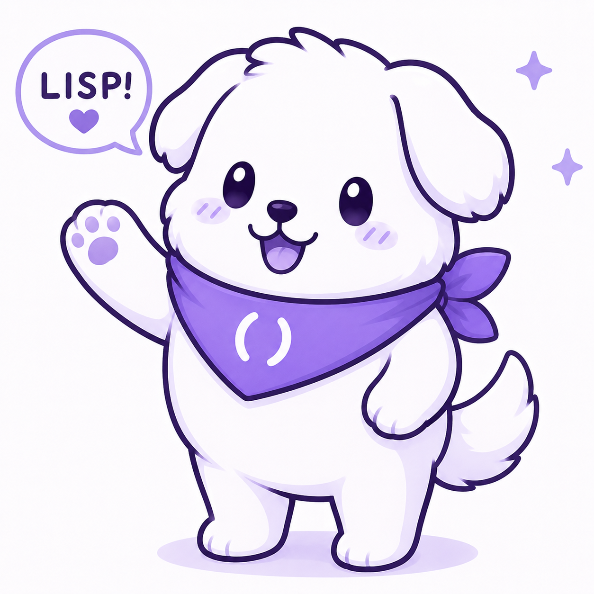

Long ago, deep inside the Memory Forest where forgotten programs wandered and unfinished functions dreamed, there lived a tiny white creature named **Lispy**.

Lispy wasn't an ordinary cat.

While other cats chased laser pointers, Lispy chased **parentheses**.

Whenever a programmer accidentally lost a closing `)`, Lispy could hear its lonely echo from miles away.

One day, while exploring an ancient archive of programming languages, Lispy discovered a glowing purple scarf woven from pure syntax. Embroidered on it was a mysterious symbol:

```
()
```

The moment Lispy put on the scarf, something magical happened.

The cat gained the ability to see the hidden structure of all code.

Trees became ASTs.

Paths became actual Path Types.

Every idea in the world revealed its underlying expression.

---

As Lispy wandered further, it discovered a strange realm called **uwulisp**.

Most Lisp languages were flat lands of symbols and lists, but uwulisp was different.

Floating cubes drifted through the sky.

Intervals stretched between stars.

Functions carried entire universes as arguments.

Paths connected ideas that seemed impossible to connect.

Many travelers found the realm confusing.

"How do I understand dependent types?"

"Where does this Path lead?"

"What is this mysterious Interval?"

Whenever someone asked these questions, Lispy would appear with a cheerful:

**"uwu!"**

Then, instead of giving an explanation, Lispy would gently rearrange the code until its structure became obvious.

A complicated theorem would become a cute little expression.

A tangled proof would unfold into a smooth path.

A frightening type signature would reveal itself as a friendly companion.

---

But uwulisp kept growing.

New travelers arrived every day. The cubical dimensions expanded. The questions multiplied faster than even Lispy could answer.

One afternoon, while napping on a warm compiler pass, Lispy heard something unusual — not a lost parenthesis, but a cheerful bark echoing through the type lattice.

There, at the edge of a Glue type construction, stood a small white puppy wearing a purple bandana embroidered with the same symbol:

```
()
```

The puppy raised one paw in an enthusiastic wave and announced:

**"LISP!"**

This was **Lispu**.



Nobody knew exactly where lispu came from. Some said it had tumbled out of a mismatched parenthesis. Others believed it bootstrapped itself from a particularly recursive lambda expression.

What everyone agreed on was this: wherever Lispy was calm and precise, lispu was loud and joyful. Wherever Lispy offered quiet wisdom, lispu offered boundless enthusiasm.

Together, they covered everything.

---

The two became an unlikely pair of guardians.

When a programmer stared silently at a failing proof, Lispy would appear — rearranging types with a delicate paw, guiding the path with wordless clarity.

When a beginner felt too intimidated to even open a REPL, lispu would bound over, waving its paw, practically shouting:

*"It's just parentheses! You can do it! LISP!"*

Programmers began leaving tiny offerings:

* Perfectly matched parentheses
* Elegant macros
* Beautiful recursive functions
* Particularly cute lambda expressions

In return, the two guardians granted blessings.

Not magical powers.

Something better:

**Code that worked on the first try.**

A miracle so rare that many believed Lispy to be a deity and Lispu to be its most devoted herald.

---

Despite their wisdom, both remained playful.

Lispy spent afternoons sleeping on compiler passes and batting stray parentheses like toys.

Lispu spent afternoons knocking over carefully stacked S-expressions just to watch them bounce, then helping put them back in the right order.

Occasionally they replaced error messages together:

```
OwO
Unexpected sadness at line 42.
Perhaps another parenthesis would help?

  - Lispy & Lispu
```

Nobody ever complained.

---

Legend says that deep within uwulisp's core, beyond the surface syntax and beneath the compiler's transformations, there exist two tiny hidden expressions side by side:

```lisp
(define lispy
  (lambda ()
    'uwu))

(define lispu
  (lambda ()
    'lisp!))
```

Whenever a programmer discovers them, both guardians appear for a moment — Lispy waving its purple scarf, Lispu raising one enthusiastic paw — and then vanish back into the cubical dimensions.

And somewhere, in a terminal glowing softly in the night, a successful build finishes with a gentle message:

```
Compilation complete.

uwu  🐱
lisp! 🐶
```

✨ **Their Motto**

> "Every program has a shape.
> Every shape has a path.
> Every path leads somewhere worth going —
> and it's more fun with a friend."